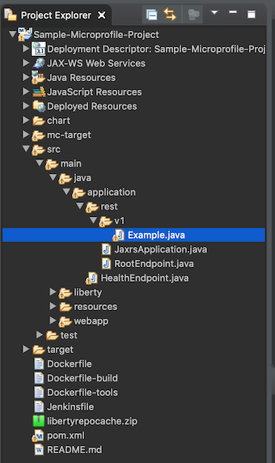
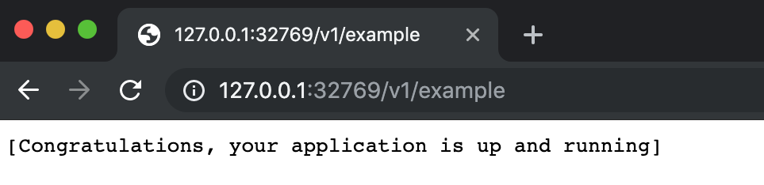

## Work in progress

# Quickstart guide to develop a Cloud Native Java Application using Codewind

Eclipse Codewind is an open source project that makes it easier for developers to create cloud-native applications within their favorite IDE. As of now, Codewind supports Visual Studio Code, Eclipse IDE and Eclipse Che. More editors will be added in the coming months.

In this tutorial, we will provide steps to develop a cloud native applications using Codewind on Eclipse IDE and VS Code.

Codewind enables you to create applications from templates and provide support for launching, updating, testing, and debugging in Docker containers on the desktop. Codewind also supports these features on Kubernetes. You can use Codewind to move existing applications to Docker and Kuberenetes. Codewind provides validation to ensure that applications follow best practices.

Codewind helps you in building high-quality cloud-native applications for Kubernetes, regardless of your IDE or language.

This tutorial covers quickstart guide to develop cloud native java applications using Eclipse IDE and VS Code.

## Working with Codewind on Eclipse IDE

Prerequisites:
- Download and install the latest [Eclipse IDE for Java EE Developers](https://www.eclipse.org/downloads/packages/release/) or use an existing installation. Eclipse IDE versions 4.11.0 onwards support Codewind. 
- Install [Docker](https://docs.docker.com/install/)

Install Codewind
1. Open the Eclipse IDE and navigate to Help > Eclipse Marketplace.
2. Search for Codewind.
3. Click the Install button.
4. Finish the wizard and accept licenses as needed.

5. When the installation is complete, restart Eclipse.
6. In Eclipse, navigate to Window -> Show View -> Other.... -> Codewind -> Codewind Explorer.

7. Codewind requires the installation of additional Docker images to run. Double-click on the Codewind item in the Codewind Explorer view to complete the installation. The installation may take a few minutes to complete.

8. Codewind creates a folder called codewind-workspace within your home directory (~/codewind-workspace on mac) to contain your projects.

>> This `codewind-workspace` can be accessed across editors. If you have created Codewind projects in Eclipse IDE, then those projects can be accessed from Visual Studio code's Codewind plugin because of the codewind-workspace folder that is compatible across editors.

### Project templates

Codewind provides a set of templates available from which you can create a project. The templates are of different types - `Standard Codewind templates`, `Kabanero Collections`, `Appsody Stacks - appsodyhub`. Some of the templates available now are - **Go**, **Lagom Java**, **Node.js Express**, **Open Liberty**, **Python**, **Sprint Boot**, **Swift**, **WebSphere Liberty Microprofile**, **Loopback** etc.. More templates will be added subsequently.

You can create your own template and use it to create a project. More details [Here](https://www.eclipse.org/codewind/mdteclipseusingadifferenttemplate.html).

### Create and run a microprofile project
In this tutorial, let us create a project using **WebSphere Liberty Microprofile** template available in Codewind.
1. In the Codewind Explorer view, ensure that Codewind is running. If not, double click Codewind item to start Codewind.
2. Upon start, expand `Codewind` item and right click on `Local Projects` and click `New Project....`.
3. Enter a name for the project and select `WebSphere Liberty MicroProfile` under templates. Click `Finish` to create the project. 

4. A new project is created with all the required directories and files for cloud native java application. Note that `Dockerfile` and `pom.xml` are created with the necessary entries.

You can edit files to suit your needs.
5. The project gets built, deployed and started.
6. A context menu on the project enables you to open your application in a browser, view application and build logs, restart in debug mode, and much more. Refer to [this link](https://www.eclipse.org/codewind/mdteclipsemanagingprojects.html) for the list of context menu items and their functionality.
7. In Codewind Explorer view, right click on the project that was created in above step, and click `Open Application`. This opens the application in the default Eclipse browser. You can start using the application.

### Modify application:

It is very easy to make the changes and deploy them. Let us modify Example.java file under `src/main/java/application/rest/v1`. 

Before making modification, check the response for http://localhost:port_no/v1/example, in a browser (get port_no from the home page of the application link from browser). 

Now, let us modify and change the display message to `Congratulations, your modified application is up and running!!!`. Save the file. Wait for a few moments for the changes to be built and deployed. Now check by invoking the rest api http://localhost:port_no/v1/example on your browser. 
The modified message should be displayed. It is this easy to modify changes in a cloud native application. 

You can then go on to modify this application to add your business logic. This way you focus on just what is needed for the business logic and not worry about other environmental issues while building a cloud native application.

### Troubleshooting

Check [Debugging Codewind projects](https://www.eclipse.org/codewind/mdteclipsedebugproject.html)
Check [troubleshooting guidelines for Codewind](https://www.eclipse.org/codewind/troubleshooting.html)

## Working with Codewind on Visual Studio Code

Prerequisites:
- Download and install [VS Code version 1.28 or later](https://code.visualstudio.com/download). 
- Install [Docker](https://docs.docker.com/install/)

Install Codewind
1. Launch VS Code IDE.
2. In the menu bar, under `view` click `Extenstions`.
3. In the search field, type `Codewind` and hit enter.
4. Install Codewind by clicking on `Install` button against Codewind entry.
5. Codewind requires the installation of additional Docker images to run. Choose Install when prompted to complete the installation. The installation may take a few minutes to complete.

Codewind is now installed.
6. Codewind creates a folder called codewind-workspace within your home directory (~/codewind-workspace on mac) to contain your projects.

>> This `codewind-workspace` can be accessed across editors. If you have created Codewind projects in Eclipse IDE, then those projects can be accessed from Visual Studio code's Codewind plugin because of the codewind-workspace folder that is compatible across editors.

### Project templates

Codewind provides a set of templates available from which you can create a project. `Standard Codewind templates`, `Kabanero Collections`, `Appsody Stacks - appsodyhub` contain templates. These have the following templates, as of now and more templates will be added - **Go**, **Lagom Java**, **Node.js Express**, **Open Liberty**, **Python**, **Sprint Boot**, **Swift**, **WebSphere Liberty Microprofile**, **Loopback** etc..
You can create your own template and use it to create a project. More details [Here](https://www.eclipse.org/codewind/mdteclipseusingadifferenttemplate.html).

### Create and run a Java project
1. Launch VSCode IDE.
2. In the `Explorer` view, expand `Codewind` and then `Projects`. 
3. Right click on `Projects` and select `Create New Project`. 
4. Select the template from which you want to create a project. For this tutuorial we'll select `Standard Codewind templates`.
5. Then select a template. Here we'll select `WebSphere Liberty Microprofile` entry.
6. Enter a name for the project and hit enter. A new Java microprofile project is created and can be seen in Codewind workpsace.
7. After a few minutes, the project is in running status, after after build and deploy. Once it is in running status, right click on the Python project in Codewind view and click `Open App`.

You will see many more options in the context menu of the application in Codewind view. Refer [this](https://www.eclipse.org/codewind/mdt-vsc-commands-project.html) to gather more detailed information.

### Modify application:

It is very easy to make the changes and deploy them. Let us modify Example.java file under `src/main/java/application/rest/v1`. 

Before making modification, check the response for http://localhost:port_no/v1/example, in a browser (get port_no from the home page of the application link from browser). 

Now, let us modify and change the display message to `Congratulations, your modified application is up and running!!!`. Save the file. Wait for a few moments for the changes to be built and deployed. Now check by invoking the rest api http://localhost:port_no/v1/example on your browser. 
The modified message should be displayed. It is this easy to modify changes in a cloud native application. 

You can then go on to modify this application to add your business logic. This way you focus on just what is needed for the business logic and not worry about other environmental issues while building a cloud native application.

### Troubleshooting
Check troubleshooting guidelines for Codewind [here](https://www.eclipse.org/codewind/mdt-vsc-troubleshooting.html)
